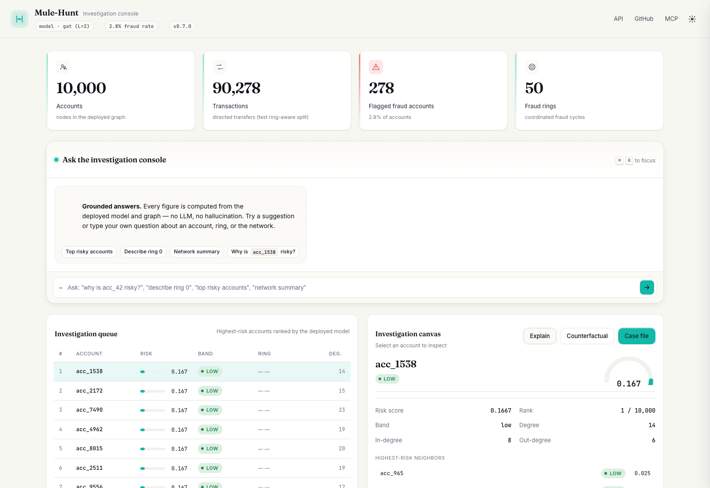

# Mule-Hunt

[](https://pypi.org/project/mule-hunt/)
[](https://github.com/sohamvjadhav/Mule-Hunt/actions/workflows/ci.yml)
[](LICENSE)
[](https://www.python.org/downloads/)
[](https://pypi.org/project/mule-hunt/)

Mule-Hunt is a graph-neural-network (GNN) pipeline for detecting coordinated
fraud in UPI-style payment networks.

The project represents payment activity as a graph:

- an account is a node;
- a transfer is a directed edge; and
- a planted fraud ring is a group of accounts that move money in a cycle.

The model predicts which accounts belong to a fraud ring. This lets the
pipeline evaluate network-level signals—such as unusual connectivity and
coordinated cycles—that are invisible when each transaction is considered in
isolation.

> **Research/demo project:** all experiments use synthetic data. The scores in
> this repository are not production fraud-detection claims and must not be
> used to make decisions about real accounts.

## What is included

- Synthetic UPI-style graph generation using
  [SantanderAI/gen-fraud-graph](https://github.com/SantanderAI/gen-fraud-graph).
- A small built-in generator for tests and offline smoke runs.
- CSV-to-[PyTorch Geometric](https://pyg.org/) graph loading.
- Ring-aware train/validation/test splits that hold out complete fraud rings.
- Three GNNs: GCN, GraphSAGE, and GATv2 — with configurable depth
  (message-passing layers) and Jumping-Knowledge aggregation instead of a
  hard-coded 2-hop receptive field.
- A transaction-level head on the same backbone: per-transfer risk scores from
  node embeddings + amount/time features, trained jointly with the node loss.
- Non-graph baselines: Random Forest, HistGradientBoosting, and optional
  XGBoost.
- Leak-aware node feature construction and class-imbalance handling.
- Isotonic probability calibration with validation-brier reporting.
- A cold-start fallback (gradient-boosted tabular model) for low-activity
  accounts, whose neighborhoods are too small for a GNN to score.
- Population-stability-index (PSI) drift monitoring between train and test
  score distributions.
- AUC, average precision, and whole-ring recovery metrics.
- A FastAPI risk-scoring service with a lightweight dashboard.
- Optional plain-language account explanations, with a deterministic local
  fallback when no API key is configured.
- An AI investigation assistant: `upifraud query` answers questions in
  plain English with fully grounded reports, and `upifraud mcp` exposes the
  same knowledge to any MCP-capable coding agent (Claude Code, Codex,
  opencode, ...).

## Dashboard


`upifraud serve` runs the FastAPI backend plus a browser dashboard: summary
metrics, the top-50 highest-risk accounts, a risk-score histogram, ring
exploration on a live graph, per-account neighborhoods, and plain-English risk
explanations (optionally generated by an LLM via `OPENAI_API_KEY`, with a
deterministic local fallback).

Explanations are model-grounded: [GNNExplainer](https://pytorch-geometric.readthedocs.io/en/latest/generated/torch_geometric.explain.algorithm.GNNExplainer.html)
runs on the account's 2-hop neighborhood and reports which features and which
neighbors drive the risk score:



## How the pipeline works

```text
synthetic CSV graph
        │
        ▼
account and transaction tables
        │
        ▼
PyG Data object
  ├── node features: account + connectivity
  ├── directed transaction edges
  ├── fraud-ring labels
  └── ring-aware train/validation/test masks
        │
        ├── GraphSAGE / GCN
        └── tabular baselines
                │
                ▼
       held-out evaluation + risk scores
                │
                ▼
        FastAPI service + dashboard
```

## Requirements

- Python 3.11 or newer
- Git, because the synthetic graph generator is installed from GitHub
- `uv` is recommended for environment and dependency management
- A CPU is sufficient for the included demo and tests

## Installation

Using `uv`:

```bash
git clone https://github.com/sohamvjadhav/Mule-Hunt.git
cd Mule-Hunt

uv venv --python 3.12
source .venv/bin/activate       # Windows PowerShell: .venv\Scripts\Activate.ps1
uv pip install -e ".[dev]"
```

Without `uv`:

```bash
python3 -m venv .venv
source .venv/bin/activate       # Windows PowerShell: .venv\Scripts\Activate.ps1
python -m pip install --upgrade pip
python -m pip install -e ".[dev]"
```

Verify the installation:

```bash
upifraud --version
pytest
```

## Quick start

Run the complete pipeline on a small synthetic graph:

```bash
upifraud demo --toy --rings 5
```

This command generates a toy graph, trains GraphSAGE, trains Random Forest and
HistGradientBoosting baselines, evaluates all saved models, and prints the
highest-scoring accounts. It writes generated data to `data/raw` and model
artifacts to `models`.

For a small graph produced by the external generator instead of the built-in
toy generator:

```bash
upifraud demo --data data/external --out-dir models-external \
  --scale 0.0001 --rings 10
```

After training, start the API and dashboard:

```bash
upifraud serve --out-dir models
```

Open <http://127.0.0.1:8000> in a browser. The API is also available at:

```bash
curl http://127.0.0.1:8000/healthz
curl http://127.0.0.1:8000/risk/account/acc_42

curl -X POST http://127.0.0.1:8000/risk/batch \
  -H 'Content-Type: application/json' \
  -d '{"account_ids": ["acc_42", "acc_99"]}'
```

The account IDs depend on the generated dataset, so replace `acc_42` and
`acc_99` with IDs that exist in your graph.

## Command-line reference

The package exposes one command, `upifraud`, with the following subcommands.

### Generate data

```bash
upifraud generate --output data/raw --scale 0.001 --rings 50
```

Use the built-in generator for a fast, deterministic smoke run:

```bash
upifraud generate --toy --output data/toy --toy-accounts 300 \
  --toy-tx 2500 --rings 5 --seed 42
```

Important generation options:

| Option | Default | Description |
| --- | ---: | --- |
| `--output` | `data/raw` | Directory for graph CSVs |
| `--scale` | `0.001` | Scale passed to `gen-fraud-graph` |
| `--rings` | generator default | Number of planted fraud rings |
| `--hardness` | `low` | Synthetic difficulty: `low`, `medium`, or `high` |
| `--workers` | `1` | Generator worker count |
| `--toy` | off | Use the built-in generator |
| `--seed` | `42` | Seed for the toy generator |

The generated directory contains `accounts/`, `transactions/`, and `fraud/`.

### Train a GNN

```bash
upifraud train-gnn \
  --data data/raw \
  --out-dir models \
  --model sage \
  --epochs 200 \
  --test-rings 3
```

Available GNNs are `sage`, `gcn`, and `gat`. The default `rings` split holds out
whole rings for testing. Use `--split random` only when you specifically want a
random node split for comparison; it is less representative of discovering a
previously unseen ring.

All three architectures are configurable in depth: `--num-layers` (default 2)
stacks message-passing layers and Jumping Knowledge (`--jk cat`, the default,
or `max`) concatenates every layer's embeddings before the classifier, so the
receptive field is 1..N hops and deeper stacks avoid over-smoothing. Use
`--edge-loss-weight 0` to drop the transaction-level head and train node-only
(the edge head is trained jointly by default with weight 0.5).

The command saves:

- `<model>.pt`: model weights;
- `<model>_args.json`: model dimensions, feature standardization values,
  validation brier before/after calibration, and cold-start metadata;
- `<model>_calib.pkl`: isotonic calibrator fitted on validation scores;
- `<model>_coldstart.joblib`: cold-start tabular model and metadata; and
- `graph.pt`: the processed graph and its split masks.

Calibration and cold-start are on by default and can be adjusted:

| Option | Default | Description |
| --- | ---: | --- |
| `--calibrate` / `--no-calibrate` | on | Fit an isotonic calibrator on validation scores |
| `--cold-start-threshold` | `10` | Combined degree below which a tabular cold-start score is used instead of the GNN |
| `--num-layers` | `2` | Message-passing depth; Jumping Knowledge aggregates all layers |
| `--jk` | `cat` | JK aggregation: `cat` or `max` |
| `--edge-loss-weight` | `0.5` | Weight of the transaction-level loss (set to `0` to disable the edge head) |
| `--temporal-features` | off | Add burst/activity-span temporal node features (requires timestamps) |

### Train a baseline

```bash
upifraud train-baseline \
  --data data/raw \
  --out-dir models \
  --model rf
```

Available baselines are `rf`, `hgb`, and `xgb`. Install the optional XGBoost
dependency before using `xgb`:

```bash
python -m pip install -e ".[dev,xgb]"
```

### Compare saved models

```bash
upifraud evaluate --out-dir models
```

This reads the saved graph and model artifacts and prints AUC, average
precision, mean ring recall, and fraud hit rate at the evaluation cutoff.

### Run the benchmark matrix

```bash
upifraud benchmark \
  --root bench \
  --scale 0.001 \
  --rings 50 \
  --test-rings 10
```

The benchmark trains the selected GNN and baselines at each requested
hardness level and writes `bench/results/benchmark.json`. Add
`--regenerate` to replace already-generated benchmark data.

### Run the temporal experiment

```bash
upifraud temporal --out-dir runs/temporal \
  --n-accounts 10000 --n-tx 120000 --rings 50 --test-rings 10 --slices 4
```

Trains a GNN at every cumulative snapshot (reveal curve) and re-scores every
later snapshot with the slice-0 model (staleness), writing
`runs/temporal/temporal.json`. Add `--temporal-features` to enable the burst
node features; see the
[temporal section](#temporal-dynamic-graph-modeling) for the honest verdict.

### Run the adversarial-robustness experiment

```bash
upifraud attack --out-dir runs/attack \
  --n-accounts 10000 --n-tx 120000 --rings 50 --test-rings 10 \
  --types inject drop --budgets 0.25,0.5,1.0
```

Trains a GNN on the clean graph, then perturbs held-out ring edges —
`inject` adds low-value camouflage transfers out of ring accounts, `drop`
deletes the earliest ring evidence — and re-scores the fixed model on each
perturbed graph, writing `runs/attack/attack.json`. See the
[adversarial section](#adversarial-robustness) for the honest verdict.

## Data and features

The external generator is the open-source synthetic
[gen-fraud-graph](https://github.com/SantanderAI/gen-fraud-graph) project,
used under Apache-2.0. No real financial data is included or required.

Mule-Hunt loads account CSVs, transaction CSVs, fraud transaction labels, and
fraud-case metadata into one PyG graph. Each account receives a node label of
`1` when it belongs to a planted ring and `0` otherwise.

Only three columns are required: `account_id` on the account CSVs, and
`tx_id`/`src_id`/`dst_id`/`amount` on the transaction CSVs. All other
attributes are optional and gracefully skipped when absent:

- `balance`, `risk_score`, `creation_date` (accounts): when missing, the
  account-attribute features are dropped and detection uses the structural
  features alone (degrees and unique counterparties, plus `--cycle-counts`);
- `timestamp` (transactions): when missing, the hour-of-day and
  account-age edge features are dropped (they cannot be computed without a
  transaction time);
- `fraud/transactions_fraud.csv` and `fraud/fraud_cases.csv`: optional, but
  required for supervised labels — without them there is nothing to train
  against, so evaluation metrics are meaningless.

By default, the node representation uses account and structural features:

- log balance;
- account risk score;
- account age;
- in-degree and out-degree; and
- unique inbound and outbound counterparties.

Constant columns are removed before training. `--amount-stats` adds inbound and
outbound amount aggregates, but those features are intentionally excluded by
default: the synthetic generator uses a distinctive amount for planted ring
transactions, so amount aggregates can reveal the label through a benchmark
artifact rather than through network structure.

`--cycle-counts` adds per-node triangle counts and the local clustering
coefficient (undirected 3-cycle structure, computed in milliseconds on the
10k-node graph via sparse adjacency multiplication). The experiment is
documented below: on gen-fraud-graph data, 32% of ring nodes sit in at least
one triangle (vs 24% of normal nodes), but the overlap is large and the
features did not help the GNN.

`--temporal-features` adds two time-aware node features (requires transaction
`timestamp`): the fraction of an account's transactions from the last 20% of
its activity window (a burst proxy) and the log width of that window. Both are
leak-aware: each is computed only from the account's *own* transaction history,
so they encode activity dynamics without exposing the label.

## Evaluation protocol

The default evaluation is designed to test whether a model can find new rings:

1. Fraud rings are split as groups, not as individual accounts.
2. All members of a held-out ring stay in the same test split.
3. Normal accounts are sampled into train, validation, and test splits.
4. Training uses class-weighted binary cross-entropy and early stopping on
   validation average precision.
5. Results are reported on the held-out test accounts.

The main metrics are:

- **AUC:** ranking quality across positive and negative accounts;
- **average precision (AP):** more informative than accuracy for the imbalanced
  fraud labels;
- **mean ring recall:** the average fraction of each held-out ring recovered in
  the top-`k` ranked accounts, where `k` is the test-set size; and
- **operating point:** precision/recall at the F1-maximizing score threshold on
  held-out rings — the number an investigator would actually deploy with.

### Current benchmark results

The committed benchmark uses approximately 10,000 accounts, 90,000 transfers,
50 rings, and 10 held-out rings. Runs include the transaction-level head
(edge AUC is reported on held-out transactions). The generator has its own
randomness, so numbers may vary slightly between runs.

| Hardness | Model | Layers | AUC | AP | Mean ring recall | Edge AUC |
| --- | --- | ---: | ---: | ---: | ---: | ---: |
| low | GraphSAGE | 2 | 0.620 | 0.056 | 0.238 | 1.000 |
| low | GraphSAGE | 3 | **0.630** | 0.058 | **0.273** | 1.000 |
| low | Random Forest | – | 0.507 | 0.036 | 0.142 | – |
| medium | GraphSAGE | 2 | **0.671** | **0.079** | **0.359** | 0.999 |
| medium | GraphSAGE | 3 | 0.610 | 0.051 | 0.324 | 0.999 |
| medium | Random Forest | – | 0.603 | 0.065 | 0.269 | – |
| high | GraphSAGE | 2 | **0.665** | 0.069 | **0.351** | 0.997 |
| high | GraphSAGE | 3 | 0.629 | 0.044 | 0.262 | 0.997 |
| high | Random Forest | – | 0.622 | 0.057 | 0.185 | – |

Full results are in [`results/benchmark.json`](results/benchmark.json). The
important comparisons: Random Forest loses ranking quality as the synthetic
fraud becomes harder while GraphSAGE retains a positive signal, and the joint
edge-head training improves the 2-layer GNN at medium/high hardness versus the
previous node-only benchmark (0.671 vs 0.638 medium; 0.665 vs 0.630 high).

### Experiment: message-passing depth (third layer + Jumping Knowledge)

Hypothesis from the roadmap: a 2-hop receptive field cannot distinguish a
6-cycle ring from a chain, so a deeper stack with Jumping Knowledge
(concatenating every layer's embeddings) should recover longer rings. All
models now support `--num-layers` with JK (`cat`/`max`), and the same
benchmark was run at 2 and 3 layers (see the table above).

**Verdict: the third layer does not help at medium/high hardness.** AUC fell
−0.061 (medium) and −0.035 (high) at 3 layers, with only a small gain at low
hardness (+0.010). On this data the rings are short enough that a 2-hop
neighborhood already contains the full ring; the extra hop aggregates mostly
unrelated normal accounts and dilutes the signal. The default remains 2
layers, the depth is fully configurable, and the negative result is reported
rather than tuned away.

### Experiment: cycle-count features (triangle counts + clustering)

Hypothesis from the roadmap: a 2-layer GNN cannot distinguish a 6-cycle ring
from a chain (both look like degree-2 neighborhoods), so explicit cycle counts
might add signal. The experiment ran the same benchmark with `--cycle-counts`
(10k accounts, 50 rings, 10 held out; full results in
`bench-cc/results/benchmark.json`):

| Hardness | Model | AUC without | AUC with | Δ |
| --- | --- | ---: | ---: | ---: |
| low | GraphSAGE | 0.671 | 0.662 | −0.009 |
| low | Random Forest | 0.607 | 0.602 | −0.005 |
| medium | GraphSAGE | 0.638 | 0.620 | −0.018 |
| medium | Random Forest | 0.520 | 0.526 | +0.006 |
| high | GraphSAGE | 0.630 | 0.614 | −0.016 |
| high | Random Forest | 0.495 | 0.537 | +0.042 |

**Verdict: the features did not help the GNN** (AUC fell at every hardness),
and helped Random Forest only marginally at high hardness. Ring structure on
this data contains triangles (32% of ring nodes vs 24% of normal nodes), but
the overlap is large enough that triangle counts mostly add noise for a model
that already aggregates neighborhoods. The flag remains available
(`--cycle-counts`) and the implementation is tested; the negative result is
reported rather than tuned away. A more promising structural direction is
outlined in [issue #3](https://github.com/sohamvjadhav/Mule-Hunt/issues/3)
(transaction-level labels).

## Production hardening: calibration, cold-start, and drift

Three mechanisms make the served scores more defensible in an operational
setting.

**Isotonic calibration.** GNN raw sigmoid outputs on this data are poorly
calibrated (validation brier ~0.25). `train-gnn` fits an
[isotonic regression](https://scikit-learn.org/stable/modules/generated/sklearn.isotonic.IsotonicRegression.html)
on validation probabilities and applies it to every served score; the
validation brier before/after is recorded in `<model>_args.json` (e.g.
0.25 → 0.02 on the demo run). The `risk_score` in API responses is the
calibrated probability.

**Cold-start fallback.** Accounts with very few transactions (combined degree
below `--cold-start-threshold`, default 10) have too little neighborhood
structure for a GNN to score meaningfully. For those accounts the API routes to
a class-balanced gradient-boosted tabular model trained on the account
attributes available in the data (e.g. `balance`, `risk_score`, and `age_days`),
so a brand-new account still gets a principled score instead of a default. The
cold-start model's training AUC and feature list are stored in the training
metadata.

**PSI drift monitoring.** The model is trained on one graph and served against
data that will drift. `GET /api/drift` computes the
[population stability index](https://www.lexjansen.com/nesug/nesug06/cc/cc07.pdf)
between the train-mask and test-mask calibrated score distributions (smoothed,
default 10 bins): `stable` below 0.1, `minor_drift` below 0.25, and
`major_drift` above. On the demo run the train/test split of a single generated
graph reads as stable (PSI ≈ 0.004).

## Transaction-level risk scores

Beyond per-account risk, the same backbone carries a transaction head: an MLP
over `concat(embedding[src], embedding[dst], edge_features)` predicts whether a
specific transfer is part of a laundering path. Edge features are log amount,
hour-of-day (sin/cos), and log hours since the sender account was created.
Labels are the fraud-CSV flagged transactions that sit inside a ring, and
train/val/test edge masks are derived from their endpoints (an edge trains
only when both endpoints train), so held-out rings never leak transactions.

The two losses are summed during training with `--edge-loss-weight` (default
0.5). Evaluation reports edge AUC/AP/brier alongside the node metrics, and the
ring view of the dashboard exposes every internal transaction with its risk
score — the graph on the right colors suspicious transfers red instead of
treating a ring as one opaque blob.

> **Honest caveat:** on the synthetic generator, flagged transactions carry a
> distinctive amount (₹9,999), so the edge head reaches AUC ≈ 1.0 trivially.
> The meaningful signal is the *integration*: the same embeddings drive account
> and transaction risk, and the edge metrics give investigators a ranked list
> of transfers to examine. On real data the amount encoding would be far less
> distinctive and the structural (embedding) side would matter more.

## Temporal (dynamic-graph) modeling

Payment fraud happens in bursts: a ring's transfers concentrate in a short
window, then stop. The pipeline now supports time as a first-class axis:

- **Ring-burst synthetic data.** The built-in generator (`--toy`, also used
  by the temporal experiment) places every transaction belonging to a ring —
  cycle edges, split edges, and the ring's transfers to normal accounts —
  inside a per-ring window of `--burst-days` (default 2) while background
  traffic stays uniform across the year. This gives honest temporal structure
  to experiments.
- **Cumulative snapshots.** `build_snapshots(data, k)` slices the edge
  timeline at quantile boundaries: snapshot *s* is exactly the graph known at
  that point — node and edge features are recomputed from the edges that have
  happened so far, so nothing leaks from the future.
- **Temporal node features** (`--temporal-features`, leak-aware, off by
  default like amount stats): `burst_recent_frac` (fraction of an account's
  activity in the latest 20% of its active span — high for a laundering burst)
  and `activity_span_log` (log of the account's active time span).
- **`upifraud temporal`** runs the dynamic-graph experiment: train a fresh
  model at every snapshot (how detection improves as rings reveal) and score
  every later snapshot with the slice-0 model (model staleness — how quickly
  a fixed checkpoint decays as the world moves).

```sh
upifraud temporal --out-dir runs/temporal --n-accounts 10000 --n-tx 120000 \
  --rings 50 --test-rings 10 --slices 4
upifraud temporal --out-dir runs/temporal-tf --temporal-features   # same, + burst features
```

Results land in `runs/temporal/temporal.json` (per-slice and staleness rows).

### Experiment: temporal slices (10,000 accounts, 120,000 transfers, 4 snapshots)

The committed run holds out 10 rings and slices the edge timeline into four
cumulative snapshots. "Ring edges" counts held-out ring transfers that exist
at that point — the gradual reveal the dynamic-graph story predicts:

| Slice | Edges | Revealed ring edges | AUC (base) | AUC (+ temporal) |
| ---: | ---: | ---: | ---: | ---: |
| 0 | 30,157 | 38 | 0.697 | 0.643 |
| 1 | 60,312 | 45 | 0.710 | 0.712 |
| 2 | 90,467 | 56 | 0.683 | 0.692 |
| 3 | 120,622 | 63 | 0.683 | 0.682 |

Staleness (slice-0 model re-scored downstream): AUC 0.715 → 0.710 → 0.714.

**Verdict: the mechanism works but the synthetic signal is temporally flat.**
The reveal is real (test-ring edges grow from 38 to 63 as time advances), yet
AUC stays ~0.68–0.71 — most of a ring's structure arrives with the first
slice of its burst, and uniform background traffic means the model trained on
slice 0 does not decay (staleness ≈ training-slice performance). Adding
`--temporal-features` changes nothing at this scale (±0.01). On real payment
graphs, where criminal bursts cluster and background demand drifts, the
snapshot/forward/staleness machinery — the actual deliverable — is what would
make the temporal axis pay off.

> **Honest caveat:** on synthetic data the "gradual reveal" is engineered by
> the burst generator; real payment graphs have far messier temporal
> structure. The value of this feature is the *mechanism* — snapshot
> construction, forward evaluation, and staleness measurement — which applies
> to any timestamped graph.

## Adversarial robustness

A deployed detector faces a shifting adversary: mule networks that add
low-value camouflage transfers to look busier, or that retrofit their
transaction graph to hide/remove incriminating edges. `upifraud attack`
measures how far this can push a *fixed, already-deployed* model. It trains a
GNN on the clean graph and re-scores held-out rings after two perturbations
of magnitude `budget × (held-out ring edges)`:

- **`inject`** — add that many normal-looking transfers out of ring accounts
  to non-ring accounts (camouflage; every injected edge is feature-labeled
  as a normal transfer);
- **`drop`** — delete that many of the earliest held-out ring fraud edges
  (evidence removal).

The model is re-scored on each perturbed graph with the *same* weights, and
node features are recomputed from the perturbed CSVs — the realistic setting
where the deployed extraction pipeline would also see the attack edges in the
degree/counterparty features. Results:

| Attack | Budget | Edits | Test AUC | Δ vs clean |
| --- | ---: | ---: | ---: | ---: |
| — (clean) | 0 | 0 | 0.695 | — |
| inject | 0.25 | 16 | 0.709 | +0.014 |
| inject | 0.50 | 32 | 0.721 | +0.026 |
| inject | 1.00 | 63 | 0.749 | +0.054 |
| drop | 0.25 | 16 | 0.664 | −0.031 |
| drop | 0.50 | 32 | 0.633 | −0.062 |
| drop | 1.00 | 63 | 0.578 | −0.117 |

**Verdict: the model is far more fragile to evidence removal than to
camouflage — and naive camouflage can backfire.** Deleting a quarter of a
held-out ring's edges costs ~0.03 AUC of a full deletion ~0.12: the GNN
learns ring *structure*, so removing it genuinely releases detection.
Injecting ordinary transfers *helps* the detector (up to +0.054): a few
low-value edges just make ring hubs look busier, which the structural head
reads as extra evidence — camouflage, as scattershot, does not transfer. On
a real graph the asymmetry is the actionable takeaway: invest in
tamper-evident transaction history (so incriminating edges cannot be
silently deleted) before hardening against traffic-filling, and note that a
serious adversary would *restructure* — split the ring across many fresh
low-degree mule accounts — which is a much harder fight that this simple
edge edit does not cover.

> **Honest caveat:** this is a *fixed-model* evaluation — an attacker adapts to
> the model over time, which is out of scope. Noise edges are engineered to
> look like background (uniform low amounts); a targeted attack that mirrors
> a ring's exact footprint would be a larger drop. The robust takeaway is
> relative (drop ≫ inject), not absolute.

## Risk API

`upifraud serve` loads a trained GNN checkpoint and `graph.pt` from the same
output directory. It exposes both machine-readable risk scores and the
dashboard endpoints.

| Method | Endpoint | Purpose |
| --- | --- | --- |
| `GET` | `/healthz` | Service status, model name, calibration, and node count |
| `GET` | `/risk/account/{account_id}` | Risk score for one account (cold-start fallback for low-activity accounts) |
| `POST` | `/risk/batch` | Risk scores for multiple account IDs |
| `GET` | `/api/summary` | Dataset and model summary (incl. calibration and cold-start status) |
| `GET` | `/api/top?k=50` | Highest-risk accounts |
| `GET` | `/api/account/{account_id}` | Account details and high-risk neighbors |
| `GET` | `/api/ring/{ring_id}` | Ring members, internal edges, and per-transaction risk scores |
| `GET` | `/api/distribution?bins=20` | Risk-score histogram |
| `GET` | `/api/drift?bins=10` | PSI between train and test score distributions (bins 4..50) |
| `GET` | `/api/explain/{account_id}` | Plain-language risk explanation + model-grounded evidence (GNNExplainer drivers) |

Risk scores are in `[0, 1]` and mapped to bands as follows:

- `low`: score `< 0.4`;
- `medium`: `0.4 ≤ score < 0.7`; and
- `high`: score `≥ 0.7`.

Explanations are generated locally by default and are model-grounded: the
service runs [GNNExplainer](https://pytorch-geometric.readthedocs.io/en/latest/generated/torch_geometric.explain.algorithm.GNNExplainer.html)
on the account's 2-hop neighborhood (capped at 512 nodes for dashboard
latency) and reports the features with the highest attribution masks and the
most influential neighbors (`model_evidence` in the response). Set
`OPENAI_API_KEY` before starting the service to enable the optional remote
explanation path, which rewrites the evidence into a plain-language narrative;
the service falls back to the local explanation if the request fails.

## AI investigation assistant

Beyond the API, Mule-Hunt speaks natural language. `upifraud query` answers
questions like "why is account acc_1344 risky?" with an investigation-style
report built entirely from graph facts — cycle membership, internal transfer
totals and timing, counterparty risk, and the model's own top suspicious
transactions. There is no LLM in the loop and nothing is hallucinated: every
sentence is a rendered fact, so the output is safe to hand to an investigator
or to a coding agent.

```bash
upifraud query --out-dir models \
  "why is acc_1344 risky?" "describe ring 2" "top accounts"
# add --json for the structured facts behind the prose
```

Example answer for a ring account:

```text
Investigation: acc_1344
Risk: 0.987 (HIGH) — ranked 3 of 10,000 accounts.
Ring member: acc_1344 sits in a planted ring of 4 accounts
  (4 internal transfers, ₹39,996 moved across 1 day(s)).
Activity: 7 outgoing and 8 incoming transfers (degree 15).
Timing: first edge at 1753410508, last at 1753496908 — 15 timestamped edges.
Highest-risk counterparties: acc_846 (0.025), acc_...
Top suspicious transfer: acc_1344 → acc_1715 (₹9,999) with transaction risk 0.991.
```

### MCP server for coding agents

`upifraud mcp` exposes the same knowledge as an
[MCP](https://modelcontextprotocol.io) server over stdio, so any MCP-capable
agent (Claude Code, Codex, opencode, ...) can investigate the graph with
grounded tools instead of guessing:

| Tool | Purpose |
| --- | --- |
| `network_summary` | Nodes, edges, rings, fraud counts, model in use |
| `account_risk(account_id)` | Score, band, rank, degree, label |
| `explain_account(account_id)` | Why the account is (or is not) risky, as prose |
| `investigate(account_id)` | Facts + rendered report |
| `ring_details(ring_id)` | Members, internal transfers, amounts, timing |
| `top_risky(k)` | The k highest-risk accounts |

Wire it up, e.g. in an MCP client config:

```json
{
  "mcpServers": {
    "mule-hunt": {
      "command": "upifraud",
      "args": ["mcp", "--out-dir", "models"]
    }
  }
}
```

or directly: `make mcp`. The server is deterministic — no external model
calls, no API keys — so agents get verifiable answers about the graph.

## Repository layout

```text
src/upifraud/
├── api.py          FastAPI risk service and dashboard endpoints
├── assistant.py    Grounded natural-language investigation reports
├── baseline.py     Random Forest, HGB, and XGBoost baselines
├── cli.py          upifraud command-line interface
├── dataset.py      CSV loading and ring-aware splitting
├── evaluate.py     AUC, AP, and ring-recovery metrics
├── features.py     Account and graph feature construction
├── generate.py     External and toy graph generators
├── mcp_server.py   MCP (stdio) tools for coding agents
├── models.py       GCN, GraphSAGE, and GATv2 (configurable depth/JK + edge head)
└── train.py        GNN training and checkpoint serialization

frontend/           Static dashboard assets
tests/              Unit and API tests
results/            Committed benchmark output
pyproject.toml      Package metadata and dependencies
CONTRIBUTING.md     Contribution workflow
AGENTS.md           Guidance for AI coding agents working here
```

## Development

Agent and human onboarding starts at [`AGENTS.md`](AGENTS.md) (commands,
architecture, conventions) and [`CONTRIBUTING.md`](CONTRIBUTING.md). The
common commands are also wrapped as Make targets:

```bash
make lint          # ruff check src tests
make test          # pytest
make demo          # end-to-end smoke run on the toy graph
make mcp           # start the MCP investigation server for models/
make build         # sdist + wheel
make release-check # pyproject version must match the newest v* tag
```

For quick iteration, use the toy generator:

```bash
upifraud demo --toy --toy-accounts 120 --toy-tx 500 --rings 3
```

Releases follow the process in `AGENTS.md`: version bump in the shipping PR,
then a `vX.Y.Z` tag, which publishes to PyPI via trusted publishing.
Changes are tracked in [`CHANGELOG.md`](CHANGELOG.md); vulnerabilities go in
[`SECURITY.md`](SECURITY.md).

The project is intentionally synthetic and privacy-preserving. Do not add
secrets, real payment data, or personally identifiable information to the
repository. See [`CONTRIBUTING.md`](CONTRIBUTING.md) for the contribution
workflow.

## Limitations and next steps

- **Synthetic data:** benchmark behavior may not transfer to production payment
  networks.
- **Node- and transaction-level labels:** the current targets are ring
  membership and flagged transfers; richer labels (per-transaction laundering
  stages) are not modeled yet.
- **Receptive field is configurable, not unlimited:** the GNNs default to
  three message-passing layers with Jumping Knowledge; very long or indirect
  rings beyond ~3 hops still fall outside the receptive field.
- **Cold-start is handled by a fallback:** accounts with little graph history
  (combined degree below `--cold-start-threshold`, default 10) are scored by a
  class-balanced gradient-boosted tabular model instead of the GNN.
- **Monitoring is partial:** the service reports PSI drift between train and
  test score distributions (`/api/drift`) and a calibrated operating point, but
  investigator feedback loops are not implemented.
- **Unused text/embeddings:** generated descriptions and embeddings are not yet
  consumed by the model.

Adversarial-robustness testing and temporal (dynamic-graph) modeling are
implemented — see the [adversarial section](#adversarial-robustness) and the
[temporal section](#temporal-dynamic-graph-modeling). Planned directions
include counterfactual explanations and scaling the benchmark to larger
graphs.

## License

Mule-Hunt is released under the [MIT License](LICENSE). The synthetic graph
generator is a separate dependency distributed under Apache-2.0.
