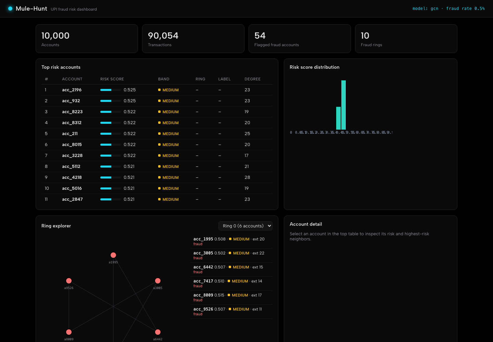

# Mule-Hunt

[](LICENSE)
[](https://www.python.org/downloads/)

Mule-Hunt is a graph-neural-network (GNN) pipeline for detecting coordinated
fraud in UPI-style payment networks.

The project represents payment activity as a graph:

- an account is a node;
- a transfer is a directed edge; and
- a planted fraud ring is a group of accounts that move money in a cycle.

The model predicts which accounts belong to a fraud ring. This lets the
pipeline evaluate network-level signals—such as unusual connectivity and
coordinated cycles—that are invisible when each transaction is considered in
isolation.

> **Research/demo project:** all experiments use synthetic data. The scores in
> this repository are not production fraud-detection claims and must not be
> used to make decisions about real accounts.

## What is included

- Synthetic UPI-style graph generation using
  [SantanderAI/gen-fraud-graph](https://github.com/SantanderAI/gen-fraud-graph).
- A small built-in generator for tests and offline smoke runs.
- CSV-to-[PyTorch Geometric](https://pyg.org/) graph loading.
- Ring-aware train/validation/test splits that hold out complete fraud rings.
- Two GNNs: GCN and GraphSAGE.
- Non-graph baselines: Random Forest, HistGradientBoosting, and optional
  XGBoost.
- Leak-aware node feature construction and class-imbalance handling.
- AUC, average precision, and whole-ring recovery metrics.
- A FastAPI risk-scoring service with a lightweight dashboard.
- Optional plain-language account explanations, with a deterministic local
  fallback when no API key is configured.

## Dashboard



`upifraud serve` runs the FastAPI backend plus a browser dashboard: summary
metrics, the top-50 highest-risk accounts, a risk-score histogram, ring
exploration on a live graph, per-account neighborhoods, and plain-English risk
explanations (optionally generated by an LLM via `OPENAI_API_KEY`, with a
deterministic local fallback).

## How the pipeline works

```text
synthetic CSV graph
        │
        ▼
account and transaction tables
        │
        ▼
PyG Data object
  ├── node features: account + connectivity
  ├── directed transaction edges
  ├── fraud-ring labels
  └── ring-aware train/validation/test masks
        │
        ├── GraphSAGE / GCN
        └── tabular baselines
                │
                ▼
       held-out evaluation + risk scores
                │
                ▼
        FastAPI service + dashboard
```

## Requirements

- Python 3.11 or newer
- Git, because the synthetic graph generator is installed from GitHub
- `uv` is recommended for environment and dependency management
- A CPU is sufficient for the included demo and tests

## Installation

Using `uv`:

```bash
git clone https://github.com/sohamvjadhav/Mule-Hunt.git
cd Mule-Hunt

uv venv --python 3.12
source .venv/bin/activate       # Windows PowerShell: .venv\Scripts\Activate.ps1
uv pip install -e ".[dev]"
```

Without `uv`:

```bash
python3 -m venv .venv
source .venv/bin/activate       # Windows PowerShell: .venv\Scripts\Activate.ps1
python -m pip install --upgrade pip
python -m pip install -e ".[dev]"
```

Verify the installation:

```bash
upifraud --version
pytest
```

## Quick start

Run the complete pipeline on a small synthetic graph:

```bash
upifraud demo --toy --rings 5
```

This command generates a toy graph, trains GraphSAGE, trains Random Forest and
HistGradientBoosting baselines, evaluates all saved models, and prints the
highest-scoring accounts. It writes generated data to `data/raw` and model
artifacts to `models`.

For a small graph produced by the external generator instead of the built-in
toy generator:

```bash
upifraud demo --data data/external --out-dir models-external \
  --scale 0.0001 --rings 10
```

After training, start the API and dashboard:

```bash
upifraud serve --out-dir models
```

Open <http://127.0.0.1:8000> in a browser. The API is also available at:

```bash
curl http://127.0.0.1:8000/healthz
curl http://127.0.0.1:8000/risk/account/acc_42

curl -X POST http://127.0.0.1:8000/risk/batch \
  -H 'Content-Type: application/json' \
  -d '{"account_ids": ["acc_42", "acc_99"]}'
```

The account IDs depend on the generated dataset, so replace `acc_42` and
`acc_99` with IDs that exist in your graph.

## Command-line reference

The package exposes one command, `upifraud`, with the following subcommands.

### Generate data

```bash
upifraud generate --output data/raw --scale 0.001 --rings 50
```

Use the built-in generator for a fast, deterministic smoke run:

```bash
upifraud generate --toy --output data/toy --toy-accounts 300 \
  --toy-tx 2500 --rings 5 --seed 42
```

Important generation options:

| Option | Default | Description |
| --- | ---: | --- |
| `--output` | `data/raw` | Directory for graph CSVs |
| `--scale` | `0.001` | Scale passed to `gen-fraud-graph` |
| `--rings` | generator default | Number of planted fraud rings |
| `--hardness` | `low` | Synthetic difficulty: `low`, `medium`, or `high` |
| `--workers` | `1` | Generator worker count |
| `--toy` | off | Use the built-in generator |
| `--seed` | `42` | Seed for the toy generator |

The generated directory contains `accounts/`, `transactions/`, and `fraud/`.

### Train a GNN

```bash
upifraud train-gnn \
  --data data/raw \
  --out-dir models \
  --model sage \
  --epochs 200 \
  --test-rings 3
```

Available GNNs are `sage` and `gcn`. The default `rings` split holds out whole
rings for testing. Use `--split random` only when you specifically want a
random node split for comparison; it is less representative of discovering a
previously unseen ring.

The command saves:

- `<model>.pt`: model weights;
- `<model>_args.json`: model dimensions and feature standardization values; and
- `graph.pt`: the processed graph and its split masks.

### Train a baseline

```bash
upifraud train-baseline \
  --data data/raw \
  --out-dir models \
  --model rf
```

Available baselines are `rf`, `hgb`, and `xgb`. Install the optional XGBoost
dependency before using `xgb`:

```bash
python -m pip install -e ".[dev,xgb]"
```

### Compare saved models

```bash
upifraud evaluate --out-dir models
```

This reads the saved graph and model artifacts and prints AUC, average
precision, mean ring recall, and fraud hit rate at the evaluation cutoff.

### Run the benchmark matrix

```bash
upifraud benchmark \
  --root bench \
  --scale 0.001 \
  --rings 50 \
  --test-rings 10
```

The benchmark trains the selected GNN and baselines at each requested
hardness level and writes `bench/results/benchmark.json`. Add
`--regenerate` to replace already-generated benchmark data.

## Data and features

The external generator is the open-source synthetic
[gen-fraud-graph](https://github.com/SantanderAI/gen-fraud-graph) project,
used under Apache-2.0. No real financial data is included or required.

Mule-Hunt loads account CSVs, transaction CSVs, fraud transaction labels, and
fraud-case metadata into one PyG graph. Each account receives a node label of
`1` when it belongs to a planted ring and `0` otherwise.

By default, the node representation uses account and structural features:

- log balance;
- account risk score;
- account age;
- in-degree and out-degree; and
- unique inbound and outbound counterparties.

Constant columns are removed before training. `--amount-stats` adds inbound and
outbound amount aggregates, but those features are intentionally excluded by
default: the synthetic generator uses a distinctive amount for planted ring
transactions, so amount aggregates can reveal the label through a benchmark
artifact rather than through network structure.

## Evaluation protocol

The default evaluation is designed to test whether a model can find new rings:

1. Fraud rings are split as groups, not as individual accounts.
2. All members of a held-out ring stay in the same test split.
3. Normal accounts are sampled into train, validation, and test splits.
4. Training uses class-weighted binary cross-entropy and early stopping on
   validation average precision.
5. Results are reported on the held-out test accounts.

The main metrics are:

- **AUC:** ranking quality across positive and negative accounts;
- **average precision (AP):** more informative than accuracy for the imbalanced
  fraud labels; and
- **mean ring recall:** the average fraction of each held-out ring recovered in
  the top-`k` ranked accounts, where `k` is the test-set size.

### Current benchmark results

The committed benchmark uses approximately 10,000 accounts, 90,000 transfers,
50 rings, and 10 held-out rings. The generator has its own randomness, so
numbers may vary slightly between runs.

| Hardness | Model | AUC | AP | Mean ring recall |
| --- | --- | ---: | ---: | ---: |
| low | GraphSAGE | **0.671** | 0.062 | **0.315** |
| low | Random Forest | 0.607 | 0.064 | 0.195 |
| medium | GraphSAGE | **0.638** | **0.062** | **0.326** |
| medium | Random Forest | 0.520 | 0.036 | 0.217 |
| high | GraphSAGE | **0.630** | **0.053** | **0.287** |
| high | Random Forest | 0.495 | 0.042 | 0.138 |

Full results are in [`results/benchmark.json`](results/benchmark.json). The
important comparison is the trend: as the synthetic fraud becomes harder,
Random Forest loses ranking quality while GraphSAGE retains a positive signal.

## Risk API

`upifraud serve` loads a trained GNN checkpoint and `graph.pt` from the same
output directory. It exposes both machine-readable risk scores and the
dashboard endpoints.

| Method | Endpoint | Purpose |
| --- | --- | --- |
| `GET` | `/healthz` | Service status, model name, and node count |
| `GET` | `/risk/account/{account_id}` | Risk score for one account |
| `POST` | `/risk/batch` | Risk scores for multiple account IDs |
| `GET` | `/api/summary` | Dataset and model summary |
| `GET` | `/api/top?k=50` | Highest-risk accounts |
| `GET` | `/api/account/{account_id}` | Account details and high-risk neighbors |
| `GET` | `/api/ring/{ring_id}` | Ring members and internal edges |
| `GET` | `/api/distribution?bins=20` | Risk-score histogram |
| `GET` | `/api/explain/{account_id}` | Plain-language risk explanation |

Risk scores are in `[0, 1]` and mapped to bands as follows:

- `low`: score `< 0.4`;
- `medium`: `0.4 ≤ score < 0.7`; and
- `high`: score `≥ 0.7`.

Explanations are generated locally by default. Set `OPENAI_API_KEY` before
starting the service to enable the optional remote explanation path; the
service falls back to the local explanation if the request fails.

## Repository layout

```text
src/upifraud/
├── api.py          FastAPI risk service and dashboard endpoints
├── baseline.py     Random Forest, HGB, and XGBoost baselines
├── cli.py          upifraud command-line interface
├── dataset.py      CSV loading and ring-aware splitting
├── evaluate.py     AUC, AP, and ring-recovery metrics
├── features.py     Account and graph feature construction
├── generate.py     External and toy graph generators
├── models.py       GCN and GraphSAGE definitions
└── train.py        GNN training and checkpoint serialization

frontend/           Static dashboard assets
tests/              Unit and API tests
results/            Committed benchmark output
pyproject.toml      Package metadata and dependencies
CONTRIBUTING.md     Contribution workflow
```

## Development

Run the test suite and linter before submitting changes:

```bash
pytest
ruff check .
```

For quick iteration, use the toy generator:

```bash
upifraud demo --toy --toy-accounts 120 --toy-tx 500 --rings 3
```

The project is intentionally synthetic and privacy-preserving. Do not add
secrets, real payment data, or personally identifiable information to the
repository. See [`CONTRIBUTING.md`](CONTRIBUTING.md) for the contribution
workflow.

## Limitations and next steps

- **Synthetic data:** benchmark behavior may not transfer to production payment
  networks.
- **Node-level labels:** the current target is ring membership; transaction-level
  classification is not implemented yet.
- **Two message-passing layers:** the current GCN and GraphSAGE models have a
  limited receptive field for long or indirect rings.
- **Cold-start accounts:** new accounts with little graph history need a
  separate fallback strategy.
- **No monitoring loop:** drift detection, threshold calibration, and feedback
  from investigators are outside the current service.
- **Unused text/embeddings:** generated descriptions and embeddings are not yet
  consumed by the model.

Planned directions include temporal and edge-level modeling, explicit cycle and
flow features, cold-start handling, and production-style drift monitoring.

## License

Mule-Hunt is released under the [MIT License](LICENSE). The synthetic graph
generator is a separate dependency distributed under Apache-2.0.
